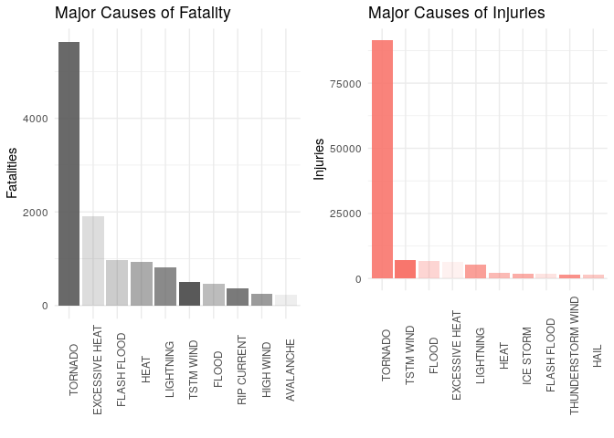
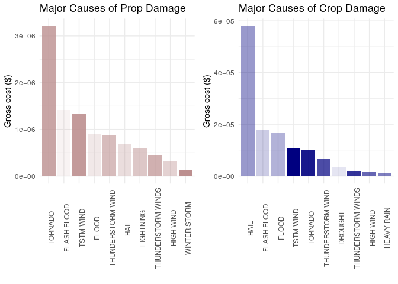
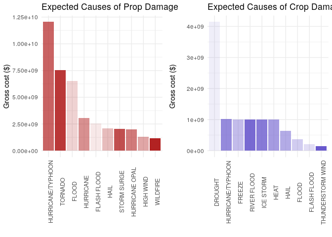

Weather Damage Report
================

> The basic goal of this project is to explore the U.S. National Oceanic
> and Atmospheric Administration’s (NOAA) storm database, seeking to
> answer some questions about severe weather events. The main focus of
> this study is to enable full-research reproducibility, using literate
> programming for every
    step.

## Tools Used

  - R language compiler
  - R base graphic devices
  - Tidyverse library packages
  - Cowplot library package
  - RMarkdown library package
  - Knitr library package

## Files

  - **Raw data set**: [Storm Database](https://d396qusza40orc.cloudfront.net/repdata%2Fdata%2FStormData.csv.bz2)
  - **[CODEBOOK](https://github.com/vcwild/weather-report/blob/process/report.html)**:
    step-by-step book explaining the code
    processing.
  - **[Figures](https://github.com/vcwild/rep-data/tree/master/PA1_template_files/figure-html)**:
    the plotted images
  - **[PA1_template.Rmd](https://github.com/vcwild/rep-data/blob/master/PA1_template.Rmd)**: the script to compile the project from source

## Build from Source

Inside the project root folder, execute the following

```
R
library(rmarkdown)
rmarkdown::render("PA1_template.Rmd", "html_document")
```
# CODEBOOK

## Data Processing

### Setup

#### Loading libraries

    ## ── Attaching packages ───────────────────────────────────────────────────────────────────────────────── tidyverse 1.3.0 ──

    ## ✓ ggplot2 3.3.0     ✓ purrr   0.3.4
    ## ✓ tibble  3.0.1     ✓ dplyr   0.8.5
    ## ✓ tidyr   1.0.2     ✓ stringr 1.4.0
    ## ✓ readr   1.3.1     ✓ forcats 0.5.0

    ## ── Conflicts ──────────────────────────────────────────────────────────────────────────────────── tidyverse_conflicts() ──
    ## x dplyr::filter() masks stats::filter()
    ## x dplyr::lag()    masks stats::lag()

    ## 
    ## ********************************************************

    ## Note: As of version 1.0.0, cowplot does not change the

    ##   default ggplot2 theme anymore. To recover the previous

    ##   behavior, execute:
    ##   theme_set(theme_cowplot())

    ## ********************************************************

#### Setting seed for reproducibility

``` r
set.seed(144)
```

#### Showing current environment

``` r
sessionInfo()
```

    ## R version 3.6.3 (2020-02-29)
    ## Platform: x86_64-pc-linux-gnu (64-bit)
    ## Running under: Ubuntu 18.04.4 LTS
    ## 
    ## Matrix products: default
    ## BLAS:   /usr/lib/x86_64-linux-gnu/blas/libblas.so.3.7.1
    ## LAPACK: /usr/lib/x86_64-linux-gnu/lapack/liblapack.so.3.7.1
    ## 
    ## locale:
    ##  [1] LC_CTYPE=pt_BR.UTF-8       LC_NUMERIC=C              
    ##  [3] LC_TIME=en_US.UTF-8        LC_COLLATE=en_US.UTF-8    
    ##  [5] LC_MONETARY=pt_BR.UTF-8    LC_MESSAGES=en_US.UTF-8   
    ##  [7] LC_PAPER=pt_BR.UTF-8       LC_NAME=C                 
    ##  [9] LC_ADDRESS=C               LC_TELEPHONE=C            
    ## [11] LC_MEASUREMENT=pt_BR.UTF-8 LC_IDENTIFICATION=C       
    ## 
    ## attached base packages:
    ## [1] stats     graphics  grDevices utils     datasets  methods   base     
    ## 
    ## other attached packages:
    ##  [1] cowplot_1.0.0   forcats_0.5.0   stringr_1.4.0   dplyr_0.8.5    
    ##  [5] purrr_0.3.4     readr_1.3.1     tidyr_1.0.2     tibble_3.0.1   
    ##  [9] ggplot2_3.3.0   tidyverse_1.3.0
    ## 
    ## loaded via a namespace (and not attached):
    ##  [1] tidyselect_1.0.0 xfun_0.13        haven_2.2.0      lattice_0.20-41 
    ##  [5] colorspace_1.4-1 vctrs_0.2.4      generics_0.0.2   htmltools_0.4.0 
    ##  [9] yaml_2.2.1       rlang_0.4.6      pillar_1.4.3     glue_1.4.0      
    ## [13] withr_2.2.0      DBI_1.1.0        dbplyr_1.4.3     modelr_0.1.7    
    ## [17] readxl_1.3.1     lifecycle_0.2.0  munsell_0.5.0    gtable_0.3.0    
    ## [21] cellranger_1.1.0 rvest_0.3.5      codetools_0.2-16 evaluate_0.14   
    ## [25] knitr_1.28       fansi_0.4.1      broom_0.5.6      Rcpp_1.0.4.6    
    ## [29] scales_1.1.0     backports_1.1.6  jsonlite_1.6.1   fs_1.4.1        
    ## [33] hms_0.5.3        digest_0.6.25    stringi_1.4.6    grid_3.6.3      
    ## [37] cli_2.0.2        tools_3.6.3      magrittr_1.5     crayon_1.3.4    
    ## [41] pkgconfig_2.0.3  ellipsis_0.3.0   xml2_1.3.2       reprex_0.3.0    
    ## [45] lubridate_1.7.8  assertthat_0.2.1 rmarkdown_2.1    httr_1.4.1      
    ## [49] rstudioapi_0.11  R6_2.4.1         nlme_3.1-147     compiler_3.6.3

#### Downloading the dataset

``` r
download.file("https://d396qusza40orc.cloudfront.net/repdata%2Fdata%2FStormData.csv.bz2", "stormdata.csv.bz2")
```

#### Read dataset into variable removing blank spaces and transform into tidyverse compatible

``` r
storm_data <- as_tibble(read.csv(file = "stormdata.csv.bz2", na.strings = ""))
```

#### Get a glimpse of the data

``` r
glimpse(storm_data)
```

    ## Rows: 902,297
    ## Columns: 37
    ## $ STATE__    <dbl> 1, 1, 1, 1, 1, 1, 1, 1, 1, 1, 1, 1, 1, 1, 1, 1, 1, 1, 1, 1…
    ## $ BGN_DATE   <fct> 4/18/1950 0:00:00, 4/18/1950 0:00:00, 2/20/1951 0:00:00, 6…
    ## $ BGN_TIME   <fct> 0130, 0145, 1600, 0900, 1500, 2000, 0100, 0900, 2000, 2000…
    ## $ TIME_ZONE  <fct> CST, CST, CST, CST, CST, CST, CST, CST, CST, CST, CST, CST…
    ## $ COUNTY     <dbl> 97, 3, 57, 89, 43, 77, 9, 123, 125, 57, 43, 9, 73, 49, 107…
    ## $ COUNTYNAME <fct> MOBILE, BALDWIN, FAYETTE, MADISON, CULLMAN, LAUDERDALE, BL…
    ## $ STATE      <fct> AL, AL, AL, AL, AL, AL, AL, AL, AL, AL, AL, AL, AL, AL, AL…
    ## $ EVTYPE     <fct> TORNADO, TORNADO, TORNADO, TORNADO, TORNADO, TORNADO, TORN…
    ## $ BGN_RANGE  <dbl> 0, 0, 0, 0, 0, 0, 0, 0, 0, 0, 0, 0, 0, 0, 0, 0, 0, 0, 0, 0…
    ## $ BGN_AZI    <fct> NA, NA, NA, NA, NA, NA, NA, NA, NA, NA, NA, NA, NA, NA, NA…
    ## $ BGN_LOCATI <fct> NA, NA, NA, NA, NA, NA, NA, NA, NA, NA, NA, NA, NA, NA, NA…
    ## $ END_DATE   <fct> NA, NA, NA, NA, NA, NA, NA, NA, NA, NA, NA, NA, NA, NA, NA…
    ## $ END_TIME   <fct> NA, NA, NA, NA, NA, NA, NA, NA, NA, NA, NA, NA, NA, NA, NA…
    ## $ COUNTY_END <dbl> 0, 0, 0, 0, 0, 0, 0, 0, 0, 0, 0, 0, 0, 0, 0, 0, 0, 0, 0, 0…
    ## $ COUNTYENDN <lgl> NA, NA, NA, NA, NA, NA, NA, NA, NA, NA, NA, NA, NA, NA, NA…
    ## $ END_RANGE  <dbl> 0, 0, 0, 0, 0, 0, 0, 0, 0, 0, 0, 0, 0, 0, 0, 0, 0, 0, 0, 0…
    ## $ END_AZI    <fct> NA, NA, NA, NA, NA, NA, NA, NA, NA, NA, NA, NA, NA, NA, NA…
    ## $ END_LOCATI <fct> NA, NA, NA, NA, NA, NA, NA, NA, NA, NA, NA, NA, NA, NA, NA…
    ## $ LENGTH     <dbl> 14.0, 2.0, 0.1, 0.0, 0.0, 1.5, 1.5, 0.0, 3.3, 2.3, 1.3, 4.…
    ## $ WIDTH      <dbl> 100, 150, 123, 100, 150, 177, 33, 33, 100, 100, 400, 400, …
    ## $ F          <int> 3, 2, 2, 2, 2, 2, 2, 1, 3, 3, 1, 1, 3, 3, 3, 4, 1, 1, 1, 1…
    ## $ MAG        <dbl> 0, 0, 0, 0, 0, 0, 0, 0, 0, 0, 0, 0, 0, 0, 0, 0, 0, 0, 0, 0…
    ## $ FATALITIES <dbl> 0, 0, 0, 0, 0, 0, 0, 0, 1, 0, 0, 0, 1, 0, 0, 4, 0, 0, 0, 0…
    ## $ INJURIES   <dbl> 15, 0, 2, 2, 2, 6, 1, 0, 14, 0, 3, 3, 26, 12, 6, 50, 2, 0,…
    ## $ PROPDMG    <dbl> 25.0, 2.5, 25.0, 2.5, 2.5, 2.5, 2.5, 2.5, 25.0, 25.0, 2.5,…
    ## $ PROPDMGEXP <fct> K, K, K, K, K, K, K, K, K, K, M, M, K, K, K, K, K, K, K, K…
    ## $ CROPDMG    <dbl> 0, 0, 0, 0, 0, 0, 0, 0, 0, 0, 0, 0, 0, 0, 0, 0, 0, 0, 0, 0…
    ## $ CROPDMGEXP <fct> NA, NA, NA, NA, NA, NA, NA, NA, NA, NA, NA, NA, NA, NA, NA…
    ## $ WFO        <fct> NA, NA, NA, NA, NA, NA, NA, NA, NA, NA, NA, NA, NA, NA, NA…
    ## $ STATEOFFIC <fct> NA, NA, NA, NA, NA, NA, NA, NA, NA, NA, NA, NA, NA, NA, NA…
    ## $ ZONENAMES  <fct> NA, NA, NA, NA, NA, NA, NA, NA, NA, NA, NA, NA, NA, NA, NA…
    ## $ LATITUDE   <dbl> 3040, 3042, 3340, 3458, 3412, 3450, 3405, 3255, 3334, 3336…
    ## $ LONGITUDE  <dbl> 8812, 8755, 8742, 8626, 8642, 8748, 8631, 8558, 8740, 8738…
    ## $ LATITUDE_E <dbl> 3051, 0, 0, 0, 0, 0, 0, 0, 3336, 3337, 3402, 3404, 0, 3432…
    ## $ LONGITUDE_ <dbl> 8806, 0, 0, 0, 0, 0, 0, 0, 8738, 8737, 8644, 8640, 0, 8540…
    ## $ REMARKS    <fct> NA, NA, NA, NA, NA, NA, NA, NA, NA, NA, NA, NA, NA, NA, NA…
    ## $ REFNUM     <dbl> 1, 2, 3, 4, 5, 6, 7, 8, 9, 10, 11, 12, 13, 14, 15, 16, 17,…

#### Count NAs

``` r
sum_na <- storm_data %>%
    summarize_all(funs(sum(is.na(.))))
```

    ## Warning: funs() is soft deprecated as of dplyr 0.8.0
    ## Please use a list of either functions or lambdas: 
    ## 
    ##   # Simple named list: 
    ##   list(mean = mean, median = median)
    ## 
    ##   # Auto named with `tibble::lst()`: 
    ##   tibble::lst(mean, median)
    ## 
    ##   # Using lambdas
    ##   list(~ mean(., trim = .2), ~ median(., na.rm = TRUE))
    ## This warning is displayed once per session.

``` r
glimpse(sum_na)
```

    ## Rows: 1
    ## Columns: 37
    ## $ STATE__    <int> 0
    ## $ BGN_DATE   <int> 0
    ## $ BGN_TIME   <int> 0
    ## $ TIME_ZONE  <int> 0
    ## $ COUNTY     <int> 0
    ## $ COUNTYNAME <int> 1589
    ## $ STATE      <int> 0
    ## $ EVTYPE     <int> 0
    ## $ BGN_RANGE  <int> 0
    ## $ BGN_AZI    <int> 547332
    ## $ BGN_LOCATI <int> 287743
    ## $ END_DATE   <int> 243411
    ## $ END_TIME   <int> 238978
    ## $ COUNTY_END <int> 0
    ## $ COUNTYENDN <int> 902297
    ## $ END_RANGE  <int> 0
    ## $ END_AZI    <int> 724837
    ## $ END_LOCATI <int> 499225
    ## $ LENGTH     <int> 0
    ## $ WIDTH      <int> 0
    ## $ F          <int> 843563
    ## $ MAG        <int> 0
    ## $ FATALITIES <int> 0
    ## $ INJURIES   <int> 0
    ## $ PROPDMG    <int> 0
    ## $ PROPDMGEXP <int> 465934
    ## $ CROPDMG    <int> 0
    ## $ CROPDMGEXP <int> 618413
    ## $ WFO        <int> 142069
    ## $ STATEOFFIC <int> 248769
    ## $ ZONENAMES  <int> 594029
    ## $ LATITUDE   <int> 47
    ## $ LONGITUDE  <int> 0
    ## $ LATITUDE_E <int> 40
    ## $ LONGITUDE_ <int> 0
    ## $ REMARKS    <int> 287433
    ## $ REFNUM     <int> 0

#### Select only needed data from the processed dataset

``` r
filter_data <- storm_data %>% 
    select(STATE, EVTYPE, FATALITIES, INJURIES, PROPDMG, PROPDMGEXP, CROPDMG, CROPDMGEXP)

glimpse(filter_data)
```

    ## Rows: 902,297
    ## Columns: 8
    ## $ STATE      <fct> AL, AL, AL, AL, AL, AL, AL, AL, AL, AL, AL, AL, AL, AL, AL…
    ## $ EVTYPE     <fct> TORNADO, TORNADO, TORNADO, TORNADO, TORNADO, TORNADO, TORN…
    ## $ FATALITIES <dbl> 0, 0, 0, 0, 0, 0, 0, 0, 1, 0, 0, 0, 1, 0, 0, 4, 0, 0, 0, 0…
    ## $ INJURIES   <dbl> 15, 0, 2, 2, 2, 6, 1, 0, 14, 0, 3, 3, 26, 12, 6, 50, 2, 0,…
    ## $ PROPDMG    <dbl> 25.0, 2.5, 25.0, 2.5, 2.5, 2.5, 2.5, 2.5, 25.0, 25.0, 2.5,…
    ## $ PROPDMGEXP <fct> K, K, K, K, K, K, K, K, K, K, M, M, K, K, K, K, K, K, K, K…
    ## $ CROPDMG    <dbl> 0, 0, 0, 0, 0, 0, 0, 0, 0, 0, 0, 0, 0, 0, 0, 0, 0, 0, 0, 0…
    ## $ CROPDMGEXP <fct> NA, NA, NA, NA, NA, NA, NA, NA, NA, NA, NA, NA, NA, NA, NA…

#### Impute 0 to NAs

``` r
tidy_storm <- filter_data %>%
    replace(is.na(.), "0"
    ) %>% 
    mutate(PROPDMGEXP = as.character(PROPDMGEXP),
           CROPDMGEXP = as.character(CROPDMGEXP))
glimpse(tidy_storm)
```

    ## Rows: 902,297
    ## Columns: 8
    ## $ STATE      <fct> AL, AL, AL, AL, AL, AL, AL, AL, AL, AL, AL, AL, AL, AL, AL…
    ## $ EVTYPE     <fct> TORNADO, TORNADO, TORNADO, TORNADO, TORNADO, TORNADO, TORN…
    ## $ FATALITIES <dbl> 0, 0, 0, 0, 0, 0, 0, 0, 1, 0, 0, 0, 1, 0, 0, 4, 0, 0, 0, 0…
    ## $ INJURIES   <dbl> 15, 0, 2, 2, 2, 6, 1, 0, 14, 0, 3, 3, 26, 12, 6, 50, 2, 0,…
    ## $ PROPDMG    <dbl> 25.0, 2.5, 25.0, 2.5, 2.5, 2.5, 2.5, 2.5, 25.0, 25.0, 2.5,…
    ## $ PROPDMGEXP <chr> "K", "K", "K", "K", "K", "K", "K", "K", "K", "K", "M", "M"…
    ## $ CROPDMG    <dbl> 0, 0, 0, 0, 0, 0, 0, 0, 0, 0, 0, 0, 0, 0, 0, 0, 0, 0, 0, 0…
    ## $ CROPDMGEXP <chr> "0", "0", "0", "0", "0", "0", "0", "0", "0", "0", "0", "0"…

#### Find unique values in prop and crop

``` r
unique_prop <- unique(tidy_storm$PROPDMGEXP)
unique_crop <- unique(tidy_storm$CROPDMGEXP)

unique_prop
```

    ##  [1] "K" "M" "0" "B" "m" "+" "5" "6" "?" "4" "2" "3" "h" "7" "H" "-" "1" "8"

``` r
unique_crop
```

    ## [1] "0" "M" "K" "m" "B" "?" "k" "2"

#### Create dictionary for the unique values

``` r
rep_prop <- c(1e3, 1e6, 0, 1e9, 1e6, 0, 1e5, 1e6, 0, 1e4, 1e2, 1e3, 1e2, 1e7, 1e2, 0, 1e1, 1e8)
rep_crop <- c(0, 1e6, 1e3, 1e6, 1e9, 0, 1e3, 1e2)

prop_dictionary <- cbind(unique_prop, rep_prop)
crop_dictionary <- cbind(unique_crop, rep_crop)
prop_dictionary
```

    ##       unique_prop rep_prop
    ##  [1,] "K"         "1000"  
    ##  [2,] "M"         "1e+06" 
    ##  [3,] "0"         "0"     
    ##  [4,] "B"         "1e+09" 
    ##  [5,] "m"         "1e+06" 
    ##  [6,] "+"         "0"     
    ##  [7,] "5"         "1e+05" 
    ##  [8,] "6"         "1e+06" 
    ##  [9,] "?"         "0"     
    ## [10,] "4"         "10000" 
    ## [11,] "2"         "100"   
    ## [12,] "3"         "1000"  
    ## [13,] "h"         "100"   
    ## [14,] "7"         "1e+07" 
    ## [15,] "H"         "100"   
    ## [16,] "-"         "0"     
    ## [17,] "1"         "10"    
    ## [18,] "8"         "1e+08"

``` r
crop_dictionary
```

    ##      unique_crop rep_crop
    ## [1,] "0"         "0"     
    ## [2,] "M"         "1e+06" 
    ## [3,] "K"         "1000"  
    ## [4,] "m"         "1e+06" 
    ## [5,] "B"         "1e+09" 
    ## [6,] "?"         "0"     
    ## [7,] "k"         "1000"  
    ## [8,] "2"         "100"

#### Remap values back into the tidy data set using plyr

``` r
tidy_storm$PROPDMGEXP <- plyr::mapvalues(tidy_storm$PROPDMGEXP, from = unique_prop, to = rep_prop)
tidy_storm$CROPDMGEXP <- plyr::mapvalues(tidy_storm$CROPDMGEXP, from = unique_crop, to = rep_crop)

tidy_storm <- tidy_storm %>% 
    mutate(PROPDMGEXP = as.double(PROPDMGEXP),
           CROPDMGEXP = as.double(CROPDMGEXP))

glimpse(tidy_storm)
```

    ## Rows: 902,297
    ## Columns: 8
    ## $ STATE      <fct> AL, AL, AL, AL, AL, AL, AL, AL, AL, AL, AL, AL, AL, AL, AL…
    ## $ EVTYPE     <fct> TORNADO, TORNADO, TORNADO, TORNADO, TORNADO, TORNADO, TORN…
    ## $ FATALITIES <dbl> 0, 0, 0, 0, 0, 0, 0, 0, 1, 0, 0, 0, 1, 0, 0, 4, 0, 0, 0, 0…
    ## $ INJURIES   <dbl> 15, 0, 2, 2, 2, 6, 1, 0, 14, 0, 3, 3, 26, 12, 6, 50, 2, 0,…
    ## $ PROPDMG    <dbl> 25.0, 2.5, 25.0, 2.5, 2.5, 2.5, 2.5, 2.5, 25.0, 25.0, 2.5,…
    ## $ PROPDMGEXP <dbl> 1e+03, 1e+03, 1e+03, 1e+03, 1e+03, 1e+03, 1e+03, 1e+03, 1e…
    ## $ CROPDMG    <dbl> 0, 0, 0, 0, 0, 0, 0, 0, 0, 0, 0, 0, 0, 0, 0, 0, 0, 0, 0, 0…
    ## $ CROPDMGEXP <dbl> 0, 0, 0, 0, 0, 0, 0, 0, 0, 0, 0, 0, 0, 0, 0, 0, 0, 0, 0, 0…

## Questions

### 1\. Across the United States, which types of events (as indicated in the EVTYPE variable are most harmful with respect to population health?

#### Rank fatalities and injuries according to EVTYPE

``` r
sum_events_global <- tidy_storm %>%
    select(-STATE) %>% 
    group_by(EVTYPE) %>%
    summarize_all(
        list(sum)
    )

sum_fatalities_global <- sum_events_global %>% 
    select(EVTYPE, FATALITIES) %>% 
    arrange(desc(FATALITIES))

sum_fatalities_top10 <- slice(sum_fatalities_global, 1:10)

sum_injuries_global <- sum_events_global %>% 
    select(EVTYPE, INJURIES) %>% 
    arrange(desc(INJURIES))

sum_injuries_top10 <- slice(sum_injuries_global, 1:10)
```

#### Plot results

``` r
plot1 <- ggplot(sum_fatalities_top10, aes(reorder(EVTYPE, -FATALITIES), FATALITIES, group = EVTYPE, alpha = EVTYPE)) +
    geom_bar(stat = "identity") +
    theme_minimal() +
    theme(
        axis.text.x = element_text(angle = 90),
        legend.position = "none"
          ) +
    labs(
        title = "Major Causes of Fatality",
        x = "",
        y = "Fatalities"
    )

plot2 <- ggplot(sum_injuries_top10, aes(reorder(EVTYPE, -INJURIES), INJURIES, group = EVTYPE, alpha = EVTYPE, fill = "red")) +
    geom_bar(stat = "identity") +
    theme_minimal() +
    theme(
        axis.text.x = element_text(angle = 90),
        legend.position = "none"
          ) +
    labs(
        title = "Major Causes of Injuries",
        x = "",
        y = "Injuries"
    )
plot_grid(plot1, plot2)
```

<!-- -->

### 2\. Across the United States, which types of events have the greatest economic consequences?

### Prepare vars for measured and expected damage

``` r
# Measured damage

propdmg_global <- sum_events_global %>% 
    select(EVTYPE, PROPDMG) %>% 
    arrange(desc(PROPDMG))

propdmg_top10 <- slice(propdmg_global, 1:10)

cropdmg_global <- sum_events_global %>% 
    select(EVTYPE, CROPDMG) %>% 
    arrange(desc(CROPDMG))

cropdmg_top10 <- slice(cropdmg_global, 1:10)

# Expected damage
exp_propdmg_global <- sum_events_global %>% 
    select(EVTYPE, PROPDMGEXP) %>% 
    arrange(desc(PROPDMGEXP))

exp_propdmg_top10 <- slice(exp_propdmg_global, 1:10)

exp_cropdmg_global <- sum_events_global %>% 
    select(EVTYPE, CROPDMGEXP) %>% 
    arrange(desc(CROPDMGEXP))

exp_cropdmg_top10 <- slice(exp_cropdmg_global, 1:10)
```

#### Plot the results

``` r
plot3 <- ggplot(propdmg_top10, aes(reorder(EVTYPE, -PROPDMG), PROPDMG, group = EVTYPE, alpha = EVTYPE)) +
    geom_bar(stat = "identity", fill = "rosybrown") +
    theme_minimal() +
    theme(
        axis.text.x = element_text(angle = 90),
        legend.position = "none"
          ) +
    labs(
        title = "Major Causes of Prop Damage",
        x = "",
        y = "Gross cost ($)"
    )

plot4 <- ggplot(cropdmg_top10, aes(reorder(EVTYPE, -CROPDMG), CROPDMG, group = EVTYPE, alpha = EVTYPE)) +
    geom_bar(stat = "identity", fill = "navyblue") +
    theme_minimal() +
    theme(
        axis.text.x = element_text(angle = 90),
        legend.position = "none"
          ) +
    labs(
        title = "Major Causes of Crop Damage",
        x = "",
        y = "Gross cost ($)"
    )
plot_grid(plot3, plot4)
```

<!-- -->

``` r
plot5 <- ggplot(exp_propdmg_top10, aes(reorder(EVTYPE, -PROPDMGEXP), PROPDMGEXP, group = EVTYPE, alpha = EVTYPE)) +
    geom_bar(stat = "identity", fill = "firebrick") +
    theme_minimal() +
    theme(
        axis.text.x = element_text(angle = 90),
        legend.position = "none"
          ) +
    labs(
        title = "Expected Causes of Prop Damage",
        x = "",
        y = "Gross cost ($)"
    )

plot6 <- ggplot(exp_cropdmg_top10, aes(reorder(EVTYPE, -CROPDMGEXP), CROPDMGEXP, group = EVTYPE, alpha = EVTYPE)) +
    geom_bar(stat = "identity", fill = "slateblue3") +
    theme_minimal() +
    theme(
        axis.text.x = element_text(angle = 90),
        legend.position = "none"
          ) +
    labs(
        title = "Expected Causes of Crop Damage",
        x = "",
        y = "Gross cost ($)"
    )
plot_grid(plot5, plot6, align = "hv")
```

<!-- -->

## Results

The extreme events that took most lives and caused most injuries in the
United States are tornado, heat, and flash flood with tornado being
about 2/3 of the total reported cases.

The events that had the most economic damage in the US are hurricanes,
tornadoes, flood and drought.
